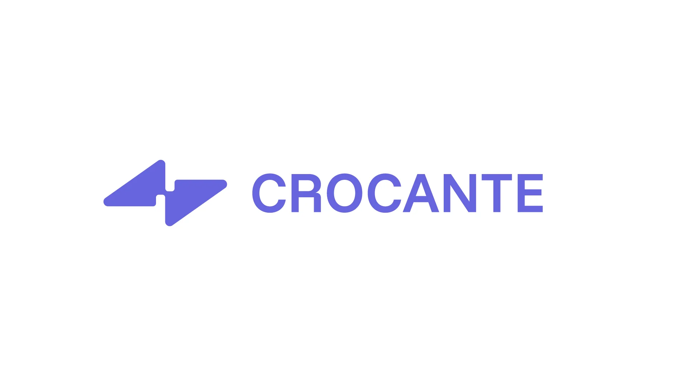
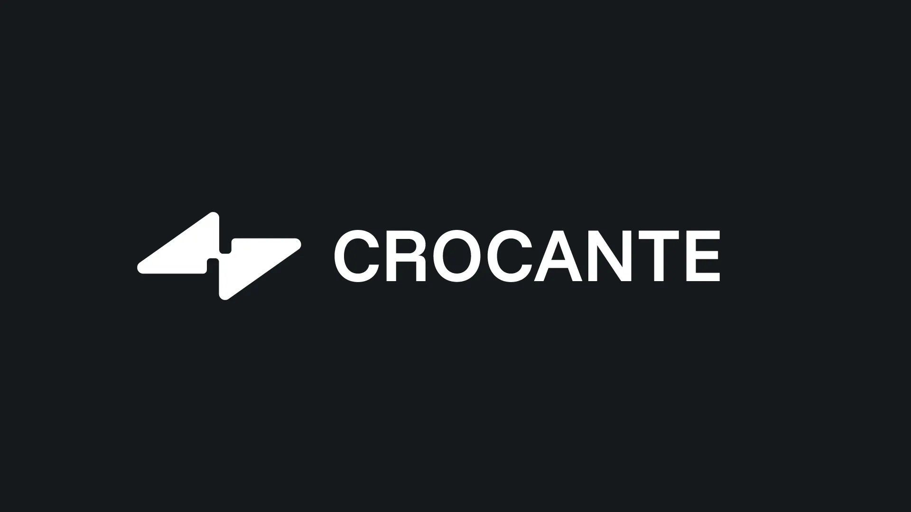
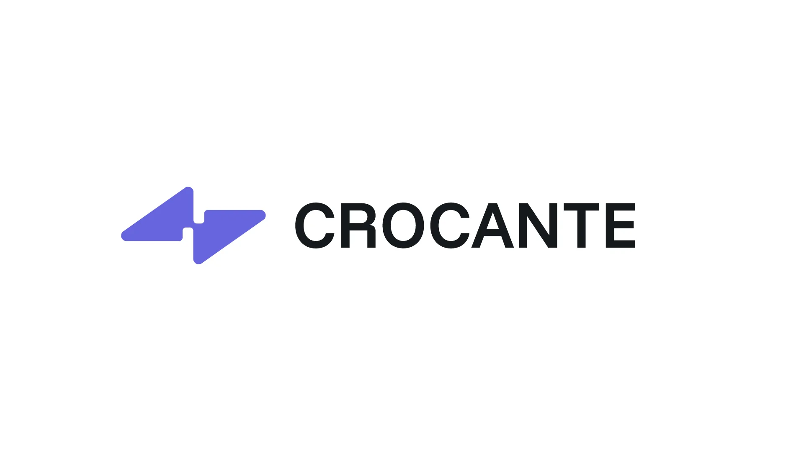
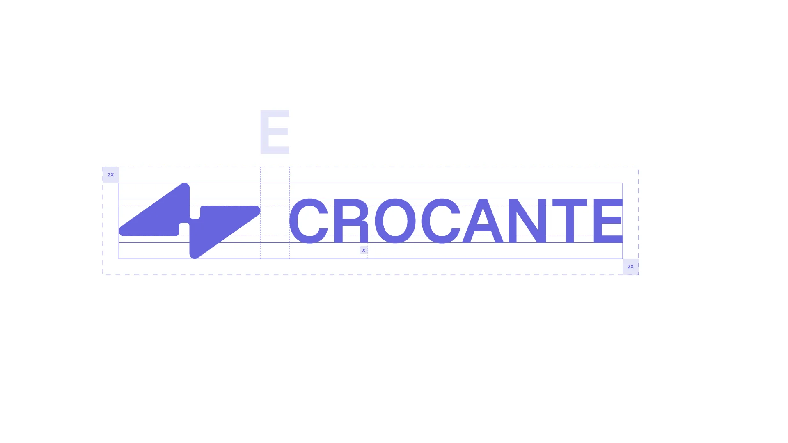
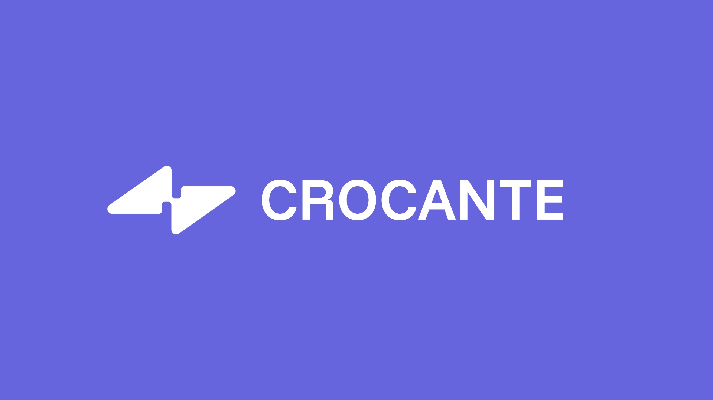
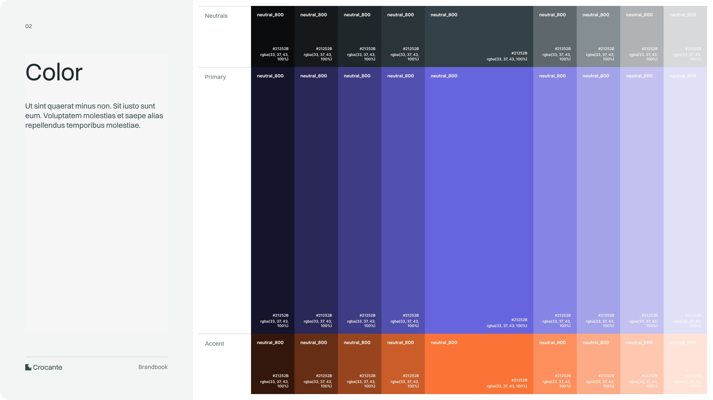
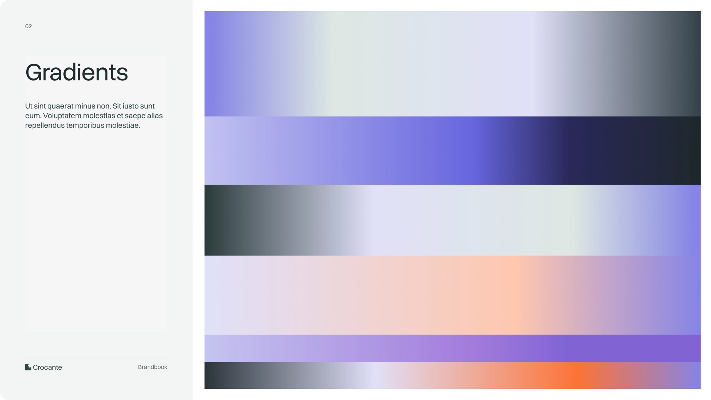
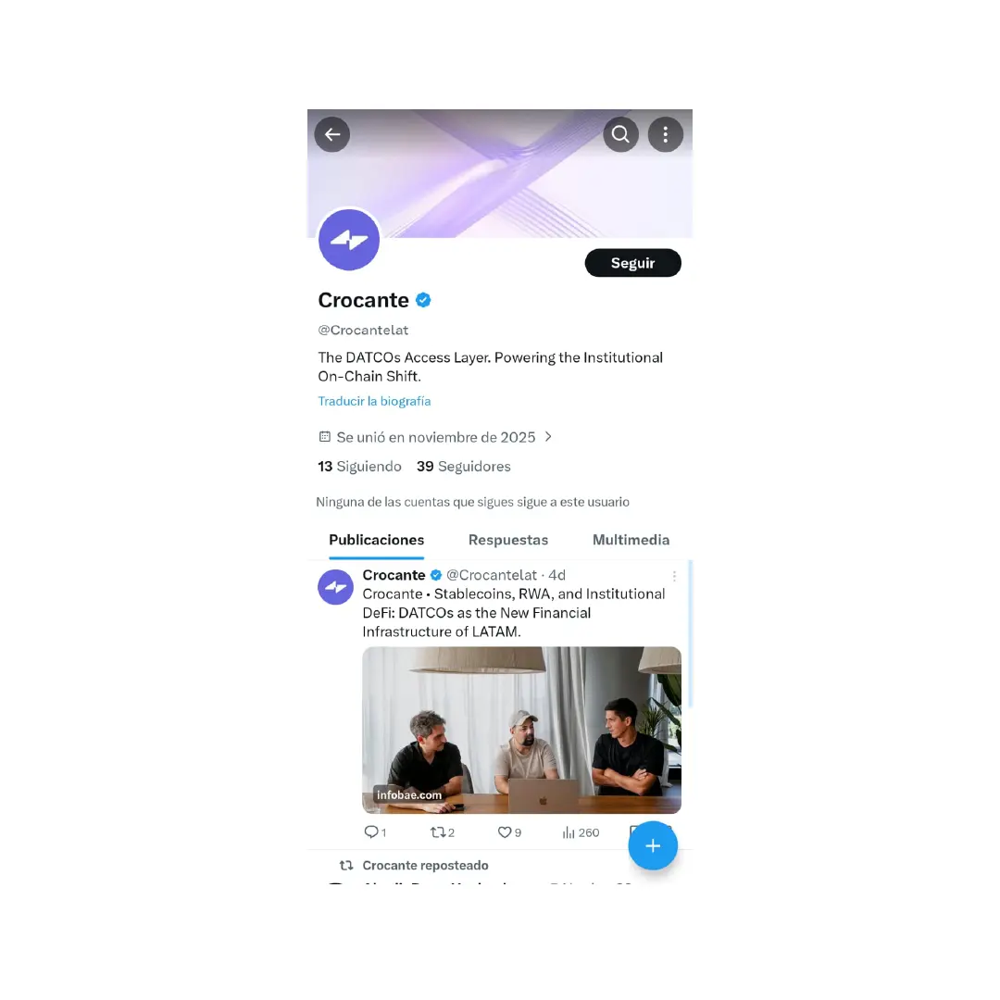
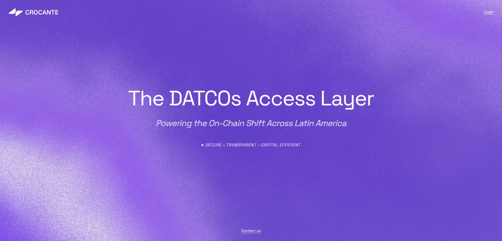
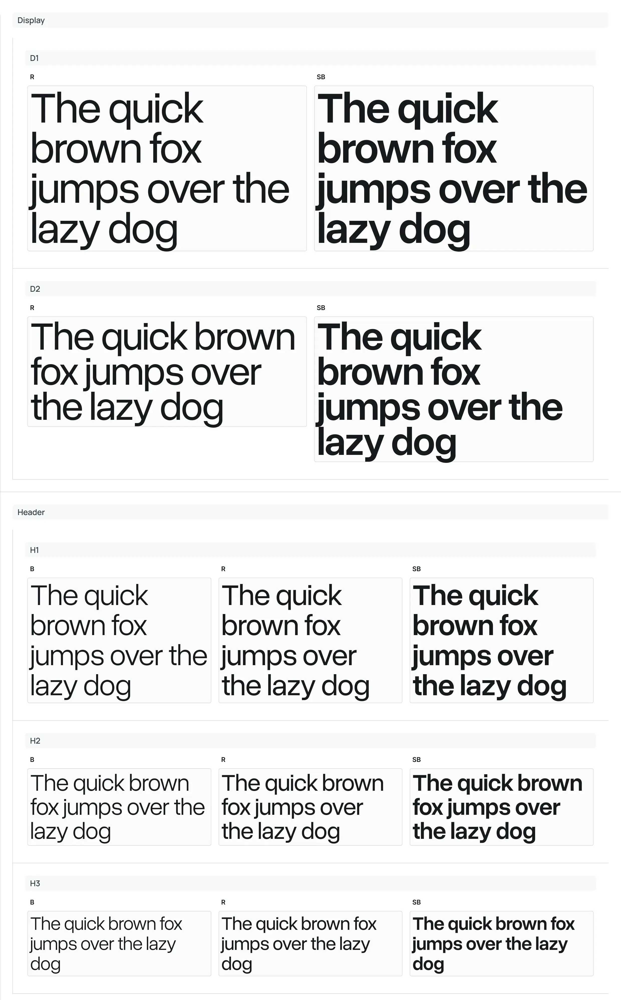

CROCANTE BRANDING

 CROCANTE ES UNA NUEVA FINTECH QUE CONECTA LAS FINANZAS TRADICIONALES CON LA ECONOMÍA DIGITAL DENTRO DEL ECOSISTEMA DEFI. BRANDING DISEÑADO EN CONJUNTO CON BORE STUDIO VIA MAX RUIZ.

Bajo el eje conceptual de "inocular lo tangible con lo digital". Captura el momento exacto en que la tensión se ordena para convertirse en forma.

La propuesta representa la dinámica energética de dos mundos en proceso de integración.    Lejos de una representación literal, el diseño apuesta por una síntesis connotativa de una idea acústica: la resonancia de algo que cruje. Es una identidad diseñada para el movimiento, que transmite confianza digital y una sutil tensión física.

 Créditos: 
 Cliente: Bore Studio & Crocante 
 Branding & Concept: Bore Studio 
 Dirección: MAX @3thecontext
 Logotype & Glyph: Insulaar 

