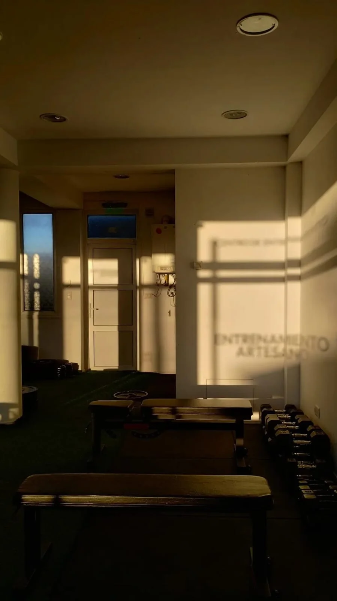
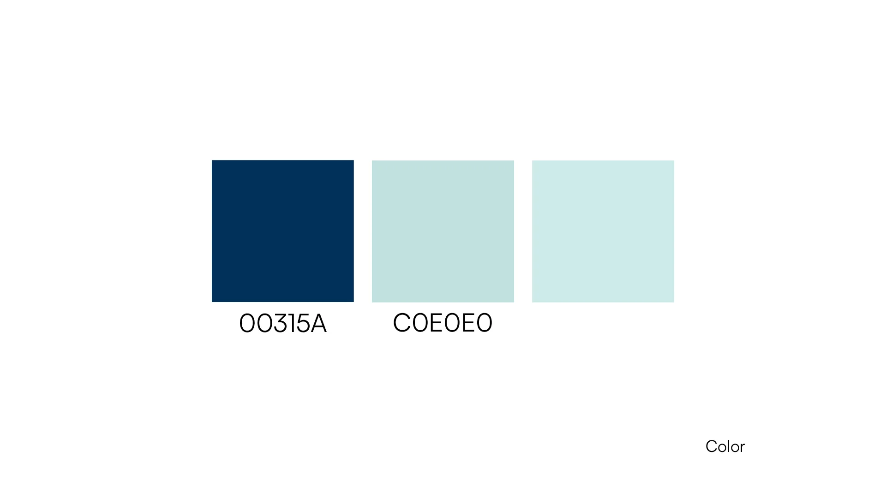
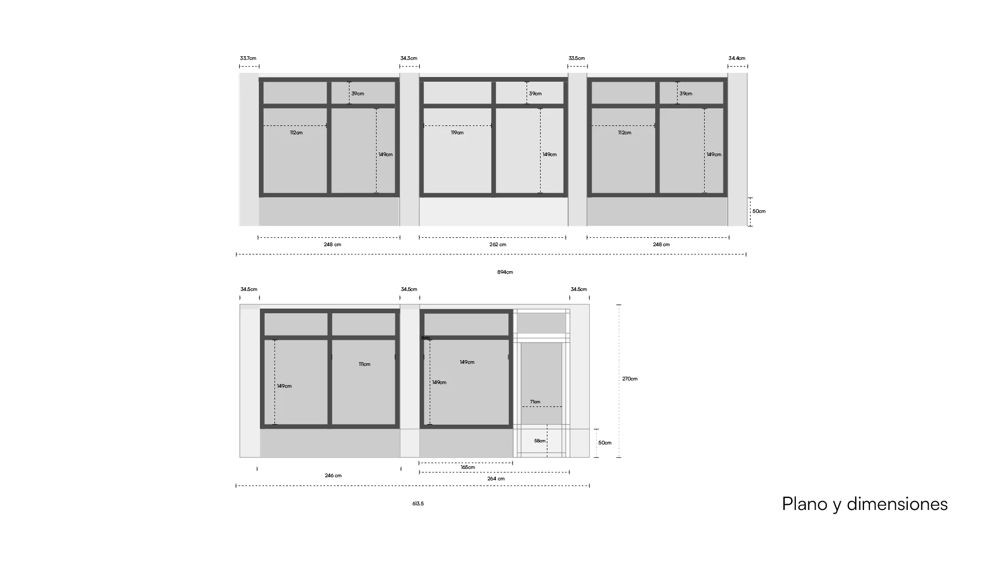
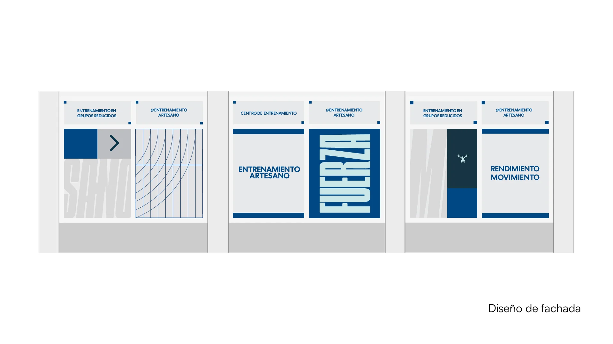
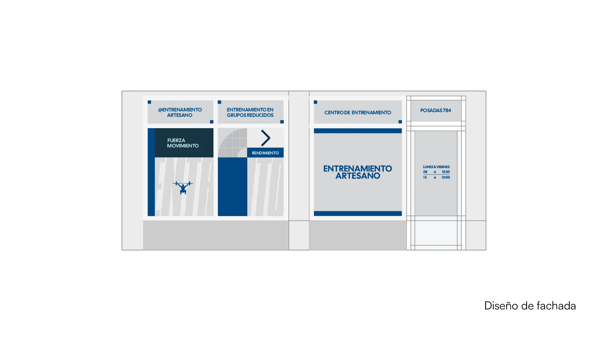
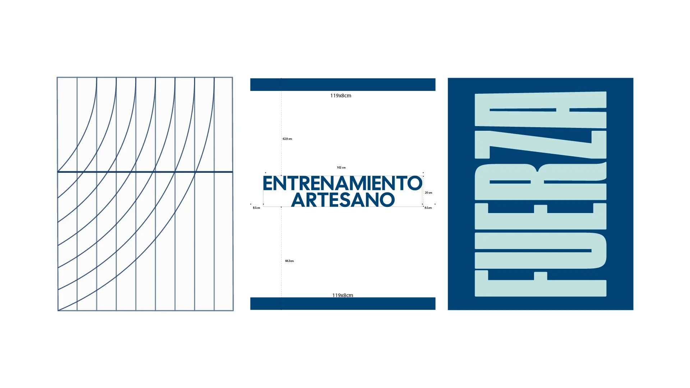

ENTRENAMIENTO ARTESANO

 ENTRENAMIENTO ARTESANO ES UN CENTRO DE ENTRENAMIENTO UBICADO EN LA CIUDAD DE RÍO GRANDE, TIERRA DEL FUEGO. EL PROYECTO ABARCÓ EL DESARROLLO DE BRANDING Y EL DISEÑO INTEGRAL DE LA FACHADA MEDIANTE VINILOS MICROPERFORADOS, BAJO UN ESTILO MODERNO, FUNCIONAL Y ATLÉTICO.  LA IDENTIDAD VISUAL BUSCA CONNOTAR DINAMISMO, FUERZA Y FLEXIBILIDAD. UN ASPECTO RELEVANTE DEL PROYECTO FUE LA INTERACCIÓN LUVÍDICA CON EL ENTORNO: LA LUZ SOLAR PROYECTA LA MARCA A TRAVÉS DE SOMBRAS Y CONTRALUCES SOBRE LAS SUPERFICIES INTERIORES DEL LOCAL, CREANDO UNA EXPERIENCIA VISUAL CAMBIANTE.

CADA PIEZA FUE DIAGRAMADA A MEDIDA SEGÚN LA MODULACIÓN DE LOS CRISTALES. LA GESTIÓN DE ARCHIVOS SE REALIZÓ BAJO ESPECIFICACIONES TÉCNICAS RIGUROSAS PARA FACILITAR SU PRODUCCIÓN Y COLOCACIÓN FINAL.

Créditos: 
 Lue 

  <video 
    id="video-clip"
    src="/img/entrenamiento artesano/reel_entrenamientoartesano.mp4" 
    muted 
    playsinline
    autoplay
    style="width: 100%; height: auto;">
  </video>

