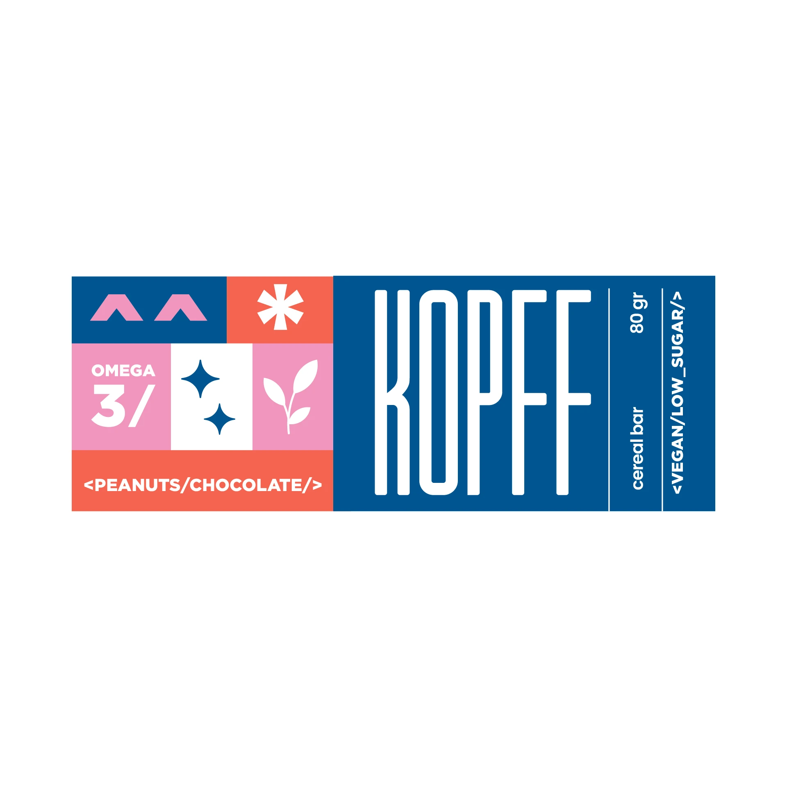
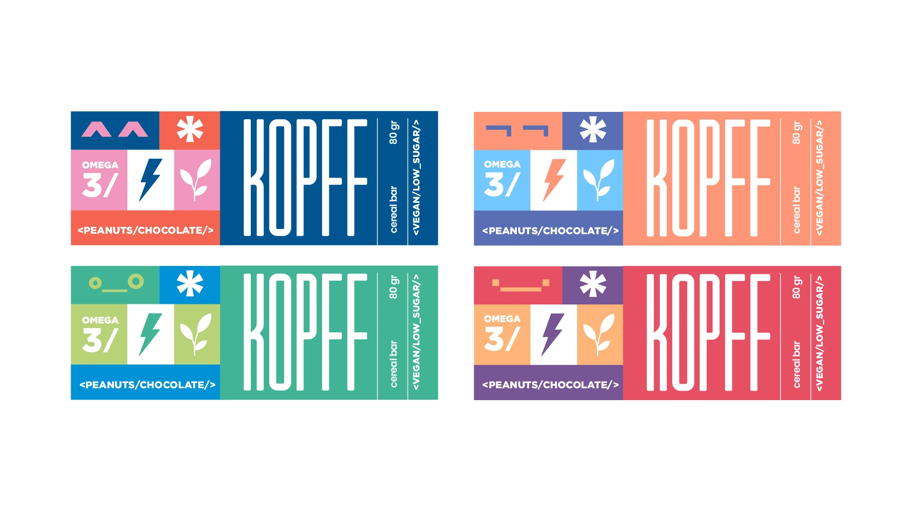
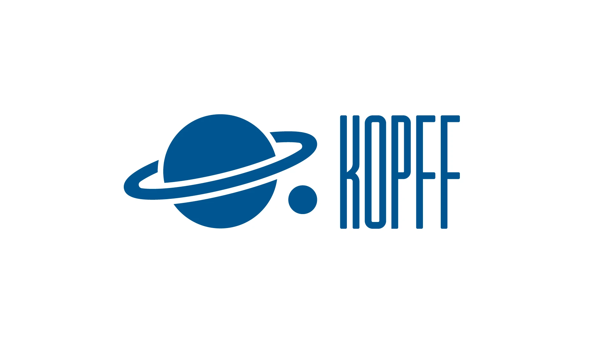
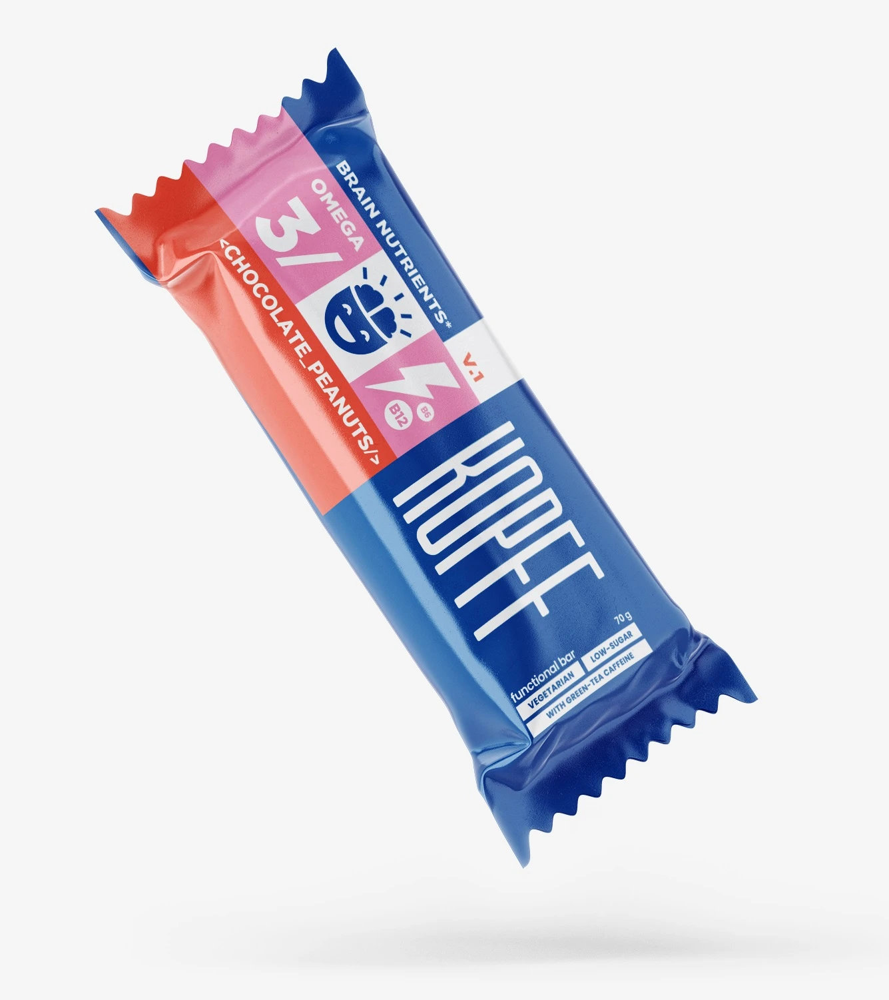
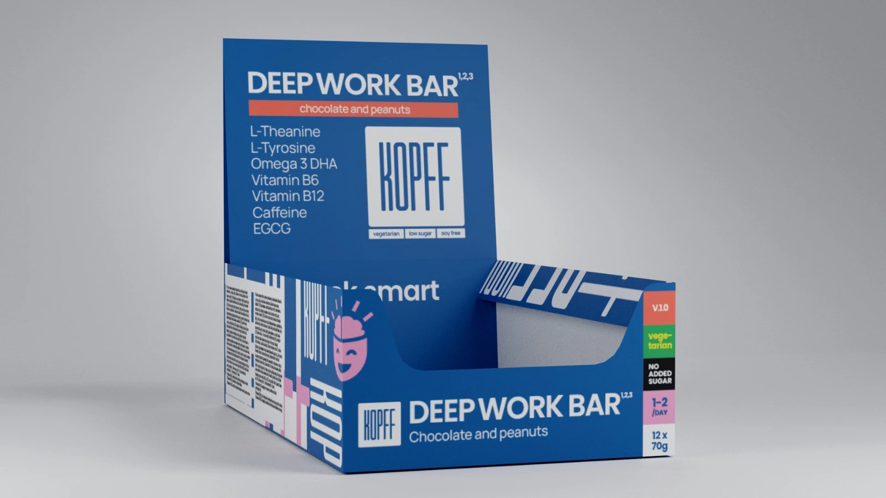
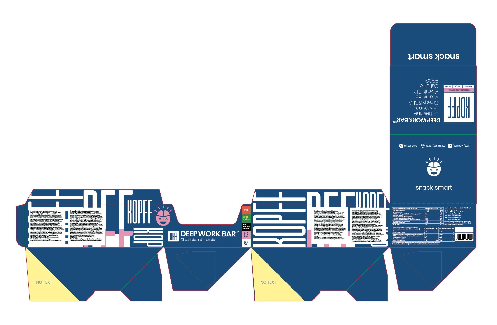
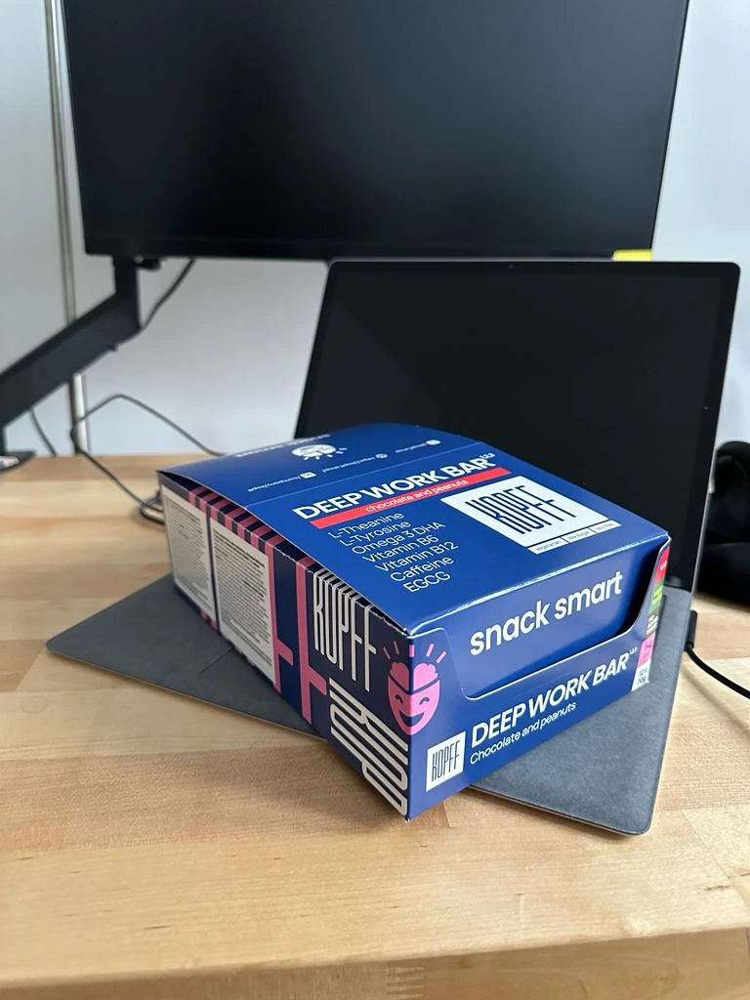
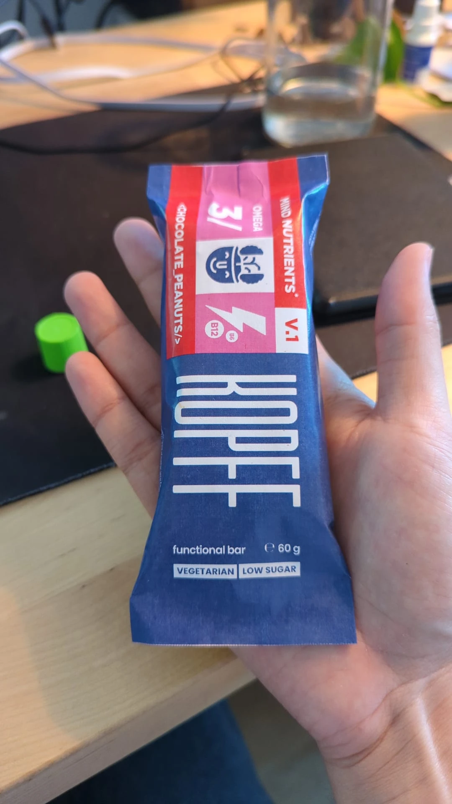
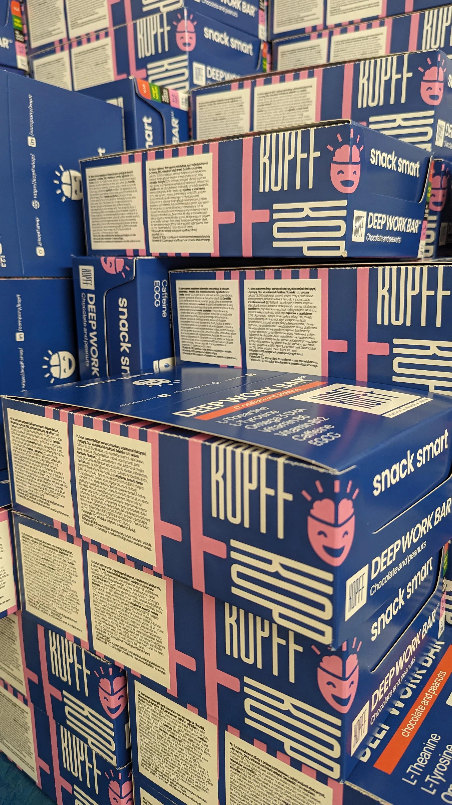
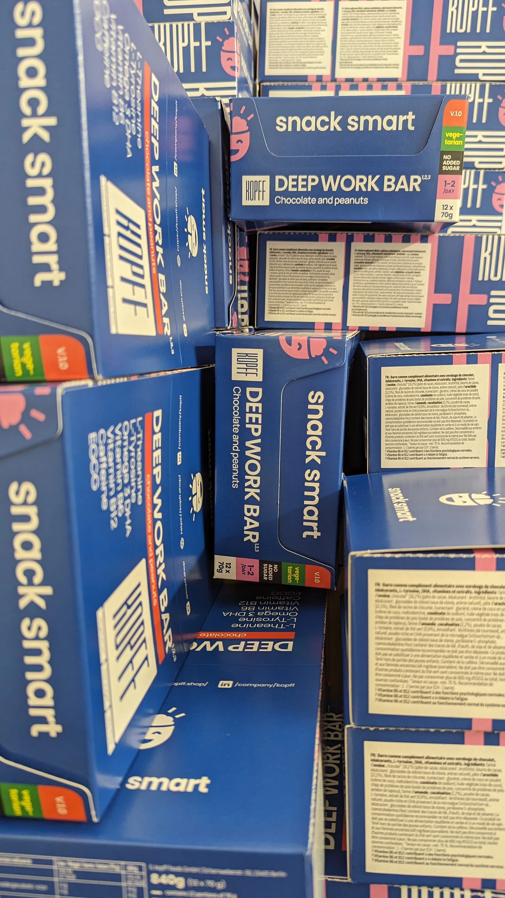

KOPFF: DEEP WORK SNACKS

 DISEÑO DE BRANDING REALIZADO POR EL ESTUDIO FLUO LABS, DIRIGIDO POR ROSARIO TRIANA Y NAHUEL ZABALZA.

KOPFF ES UNA BARRA NUTRICIONAL DE ALEMANIA, FORMULADA CON BASE CIENTÍFICA PARA MANTENER EL CEREBRO FUNCIONANDO A SU MÁXIMO POTENCIAL.

KOPFF ES UNA MARCA ENFOCADA EN EL RENDIMIENTO COGNITIVO, DISEÑADA ESPECÍFICAMENTE PARA INGENIEROS DE SOFTWARE Y PROFESIONALES QUE REQUIEREN ALTOS NIVELES DE CONCENTRACIÓN.

<video src="/img/kopff/kopff.mp4" autoplay loop muted playsinline></video>

Insular se unió al equipo creativo para el desarrollo de assets específicos, encargándose de la visualización 3d del packaging y la creación de piezas de motion design. Nuestro aporte se centró en dar volumen y movimiento a la identidad.

 Créditos: 
 Cliente: KOPFF 
 Branding & Concept: Fluo Labs 
 Dirección: Rosario Triana
 3d & Motion grapchis: Insulaar 

