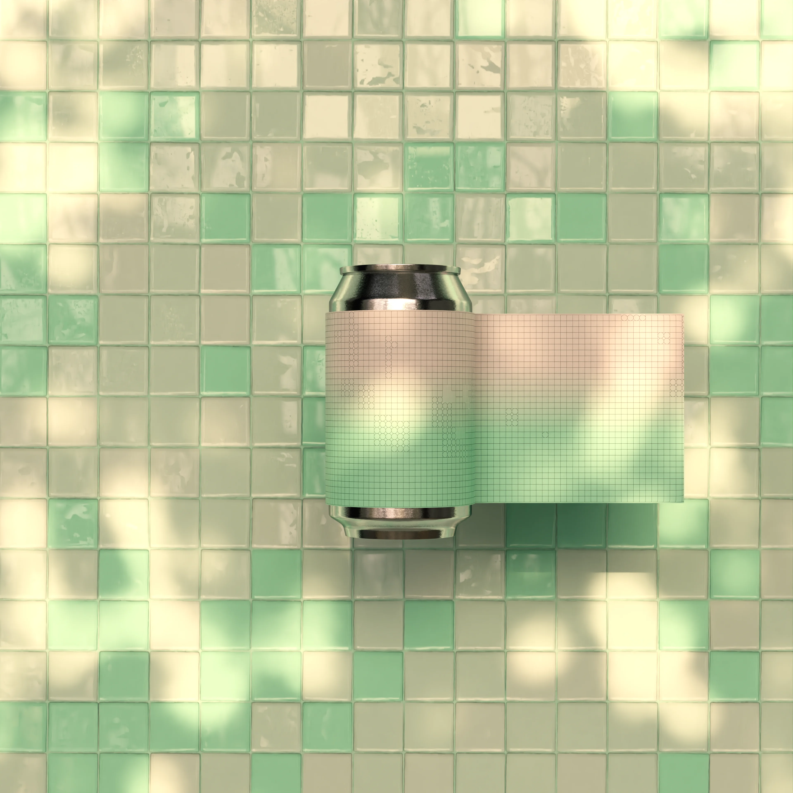
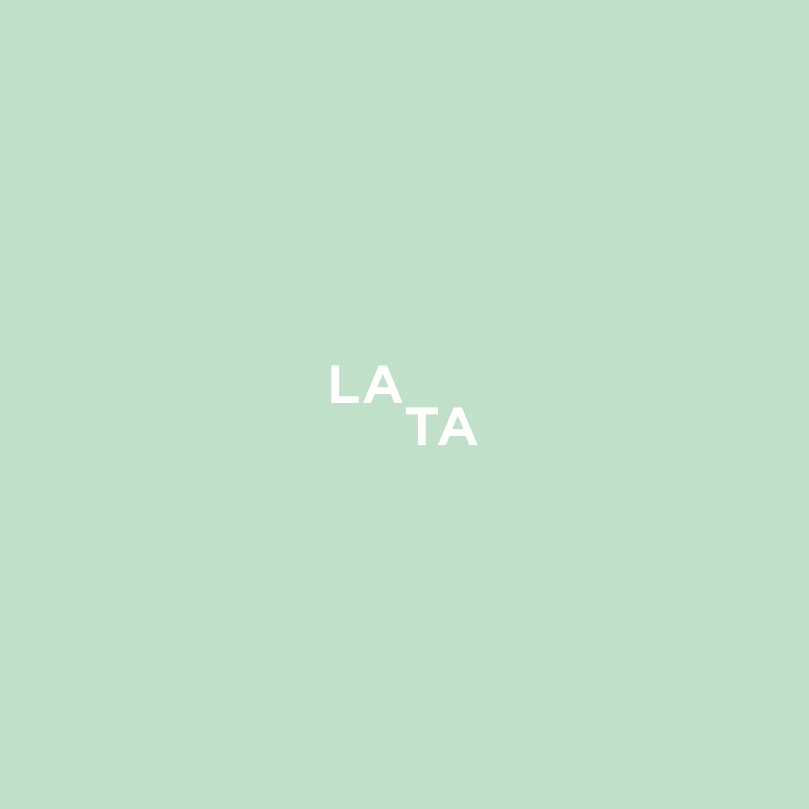
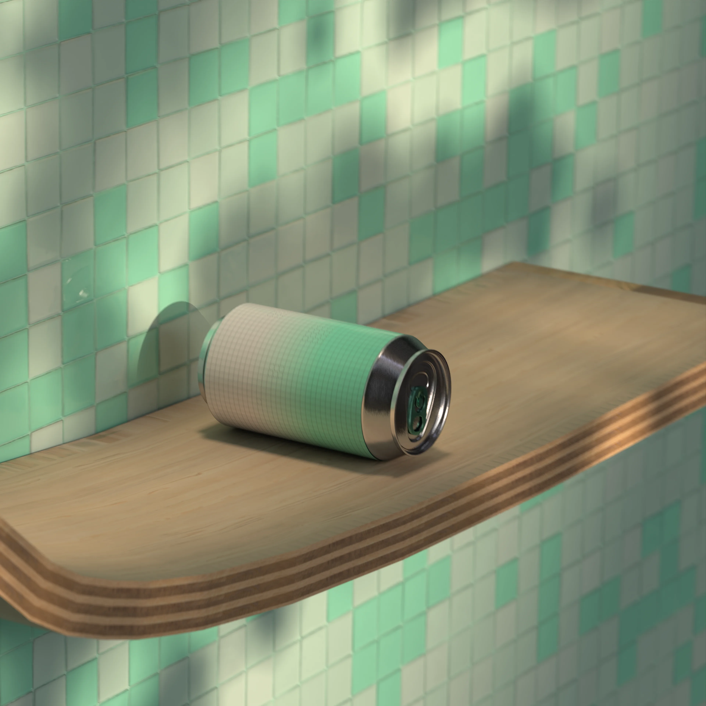
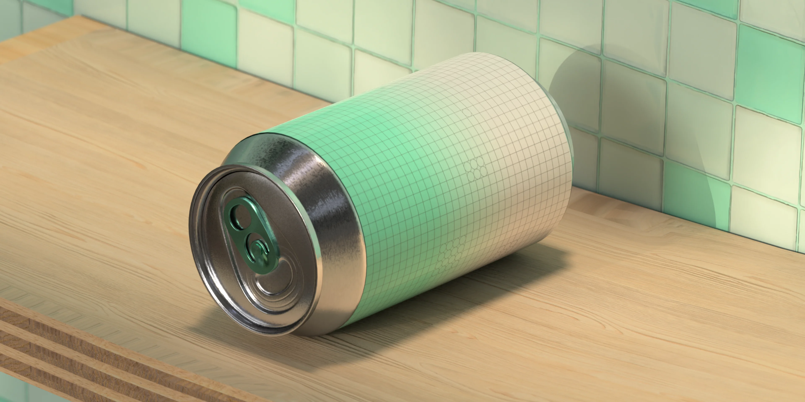
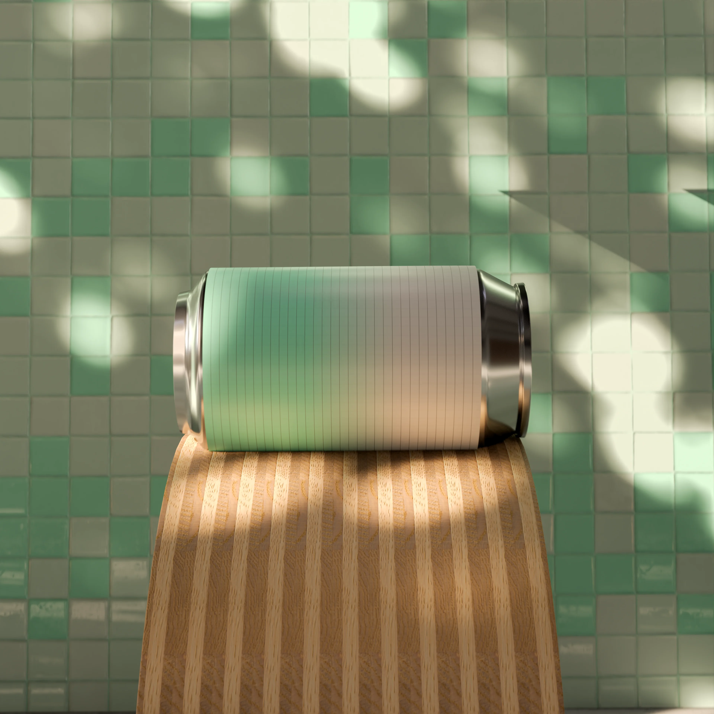

<video src="/img/lata/3.mp4" autoplay loop muted playsinline></video>

Lata

 LATA ES UN PROYECTO DE ESTUDIO DESARROLLADO ÍNTEGRAMENTE EN BLENDER. EL PROCESO ABARCÓ DESDE EL MODELADO Y TEXTURIZADO HASTA LA ANIMACIÓN Y EL RENDERIZADO FINAL UTILIZANDO EL MOTOR CYCLES.    LA INTEGRACIÓN DE TEXTURAS Y CANALES ALFA SE REALIZÓ MEDIANTE ADOBE ILLUSTRATOR.  EL MONTAJE Y LA POSTPRODUCCIÓN FINAL SE EJECUTARON   EN AFTER EFFECTS. 

 Créditos: 
 Lue 

<video src="/img/lata/1.mp4" autoplay loop muted playsinline></video>

<video src="/img/lata/2.mp4" autoplay loop muted playsinline></video>

<video src="/img/lata/4.mp4" autoplay loop muted playsinline></video>

<video src="/img/lata/5.mp4" autoplay loop muted playsinline></video>
