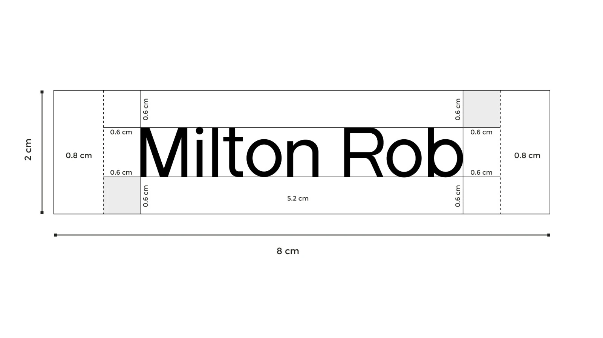
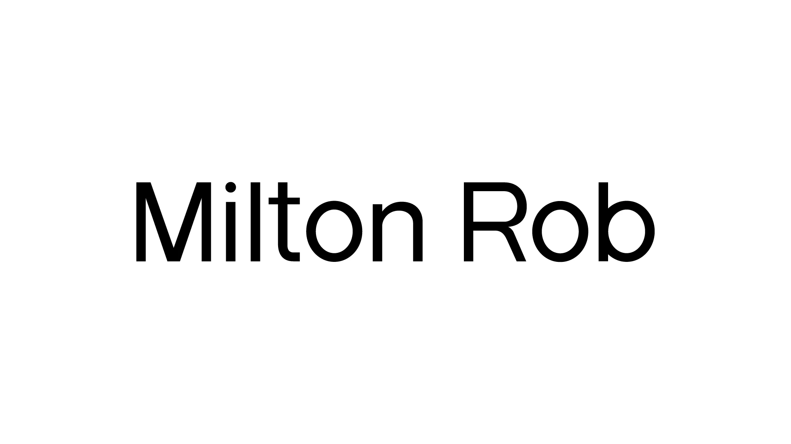
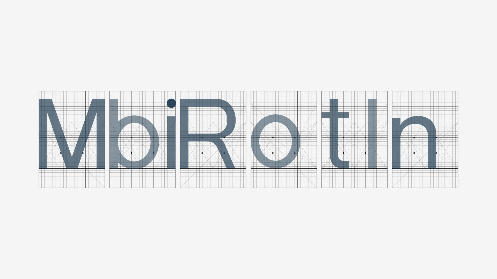
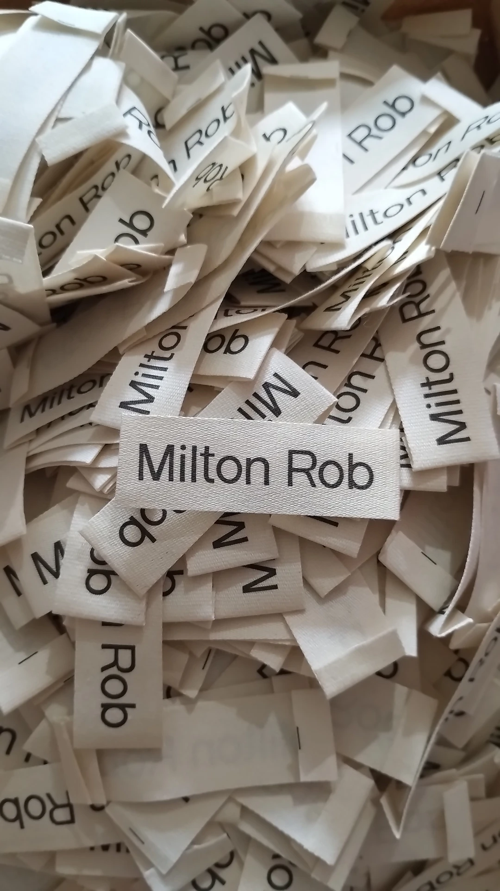
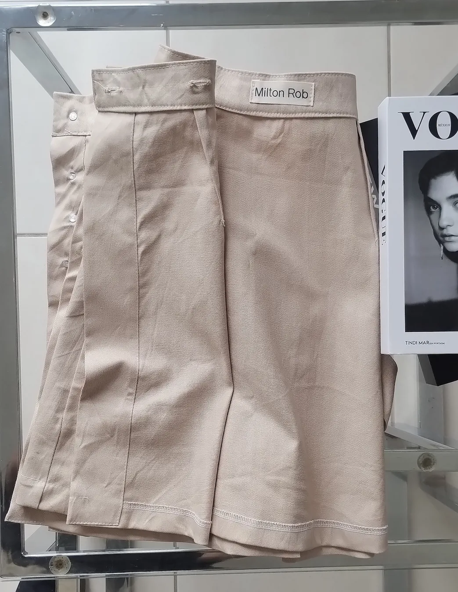
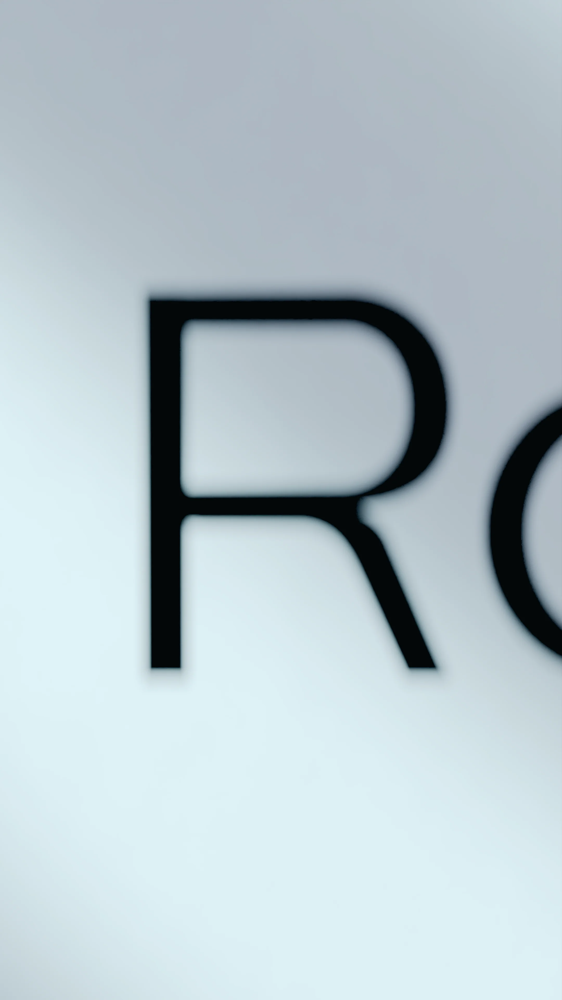

MILTON ROB | BRANDING & MOTION DESIGN

  MILTON ROB ES UNA MARCA DE INDUMENTARIA CONTEMPORÁNEA FUNDADA POR SEBA.DEV.    El proyecto abarcó la primera etapa de branding, integrando piezas animadas y el diseño técnico para la impresión de etiquetas. 

El logotipo de milton se desarrolló a partir de una tipografía custom; en lugar de utilizar una familia preexistente. diseñamos cada carácter con estricto rigor en su diagramación y proporciones. 

La identidad se alinea con la sofisticación de sus prendas: un enfoque perfeccionista en el calce, medidas y ángulos que constituyen cada patrón. como un plano de arquitectura, todo está fríamente calculado. 

<video src="/img/milton rob/3.mp4" autoplay loop muted playsinline></video>

Actualmente en desarrollo, la marca inicia su vuelo creativo mediante una serie de videos animados en blender que dan vida a este universo visual. 

 Créditos: 
 Lue 

<video src="/img/milton rob/2.mp4" autoplay loop muted playsinline></video>

<video src="/img/milton rob/4.mp4" autoplay loop muted playsinline></video>

<video src="/img/milton rob/5.mp4" autoplay loop muted playsinline></video>

