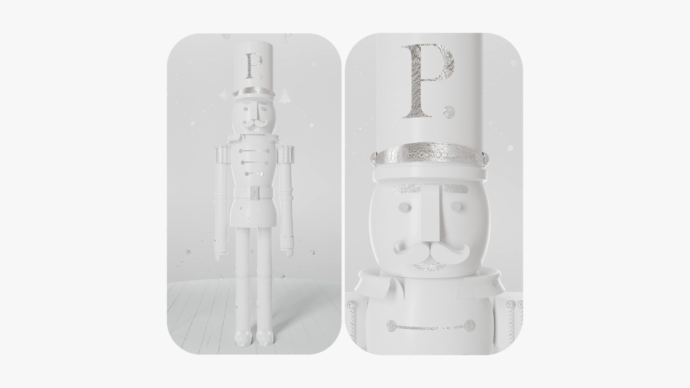

PARFUMERIE - CASCANUECES NAVIDEÑO

PARFUMERIE ES UNA DE LAS CADENAS DE PERFUMERÍA DE LUJO Y COSMÉTICA MÁS IMPORTANTES DE ARGENTINA.

<video src="/img/parfumerie/1.mp4" autoplay loop muted playsinline></video>

Para su campaña navideña 2023, diseñamos y modelamos íntegramente en 3d el personaje central de la temporada.   El desarrollo del cascanueces se realizó bajo los estrictos lineamientos de branding y estética de la marca, priorizando conceptos de elegancia, sofisticación y exclusividad.   Cuidamos cada detalle y curvatura del modelado, integrando un motivo o rapport como elemento identitario que refuerza el adn visual de parfumerie.   El resultado es una pieza de diseño tridimensional que combina tradición navideña con el lenguaje del lujo contemporáneo.

 Créditos: 
 Dirección: Giuliana Cortassa  
 Dirección de Arte: Fiore Amadio  
 Diseño y Render: Lue  

